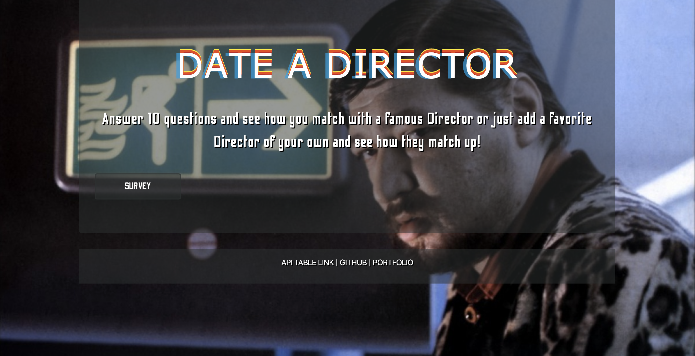
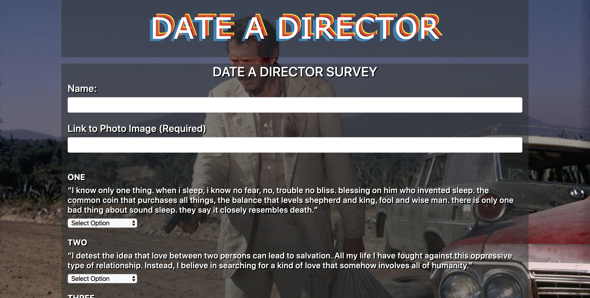
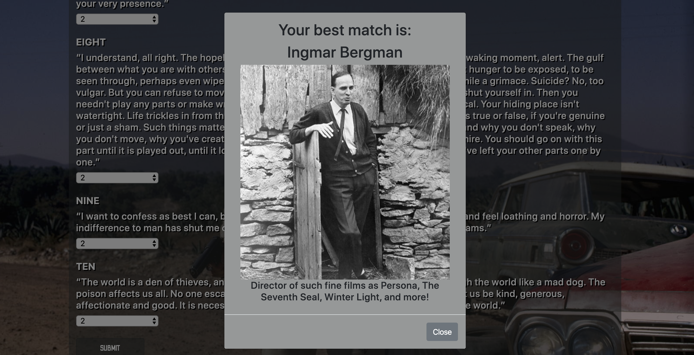
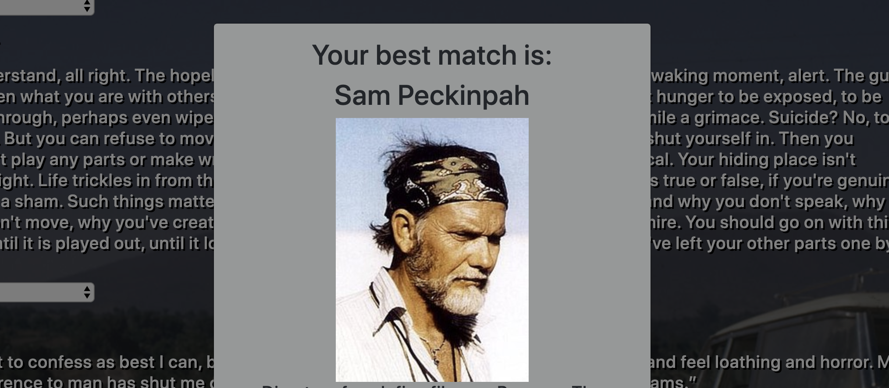

[CHECK OUT THIS DEPLOYED LINK TO HEROKU!](https://dry-temple-68536.herokuapp.com/)

___
# FRIEND FINDER APP
___
### OR AS I CALL IT DATE A DIRECTOR
### AS MY THEME IS FAVORITE DIRECTORS
---
>Created by **Christopher Gottshalk**
---
**DATE A DIRECTOR** is a compatibility-based "FriendFinder" application -- basically a dating app. This full-stack site will take in results from your users' surveys, then compare their answers with those from other users. The app will then display the name and picture of the user with the best overall match.

### INSTRUCTIONS 
---
Navigate your way to the home page. Click Survey. And select from 1 **Strongly Disagree** to 5 **Strongly Agree** on the ten Statements provided and click submit. That's it! See what director you best match with. Add in a director of your own.

---

### Pictures of App in Action!
---

**View of Homepage**
---
---

**View of Survey page**
---
---

**View of your Best Match**
---
---

**Items displaying inew new table that are low in stock**
---
---

### TECHNOLOGIES USED
---
* Javascript
* Nodejs
* jQuery
* Express
* Bootstrap
* CSS
* HTML
* Git
* GitHub

---
---

### Requirements
---
GET and POST routes
Ten statements/questions filled out in seperate friends.js file.
Server.js file requiring our npm packages and setting up our server
HTML routes page that will lead to survey page and default to home page
Api routes page that will hold our logic for comparing new users and matches from array.
Display best match in modal on survey page.